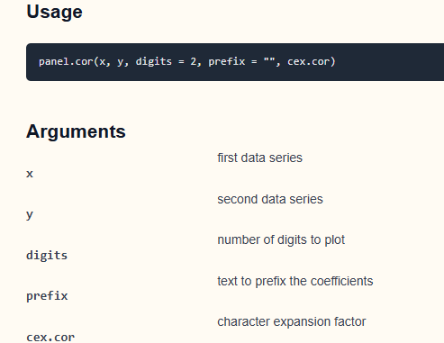

```{r}
pacman::p_load(plotly, ggtern, tidyverse)
```

-   [**ggtern**](http://www.ggtern.com/), 基于 **ggplot2** 的扩展包，专门用来绘制 **三元（Ternary）图**。

-   [**Plotly R**](https://plot.ly/r/), an R package for creating **interactive** web-based graphs

### **13.3.1 The data**

```{r}
#Reading the data into R environment
pop_data <- read_csv("Hands-on_Ex09/data/respopagsex2000to2018_tidy.csv") 

```

-   mutate()：在现有数据框上添加或修改列。

-   rowSums( .\[, x:y\] )：对当前数据框（用 . 代表）第 x 到 列的数据进行按行求和。

```{r}

agpop_mutated_1 <- pop_data %>%
  # 1. 把 Year 列从数值型转成字符型，方便后面做“宽表”展开
  mutate(`Year` = as.character(Year)) %>%
  
  # 2. 以 AG（Age Group，年龄组）为 key，把 Population（人口数）展开成多列，
  #    每个年龄组一列，宽表（wide format）
  spread(AG, Population)
```

如果只是想 看前几行

```{r}
head(agpop_mutated_1)

```

看每列的结构或摘要

```{r}
summary(agpop_mutated_1)

```

::: callout-note
根据 上面的code 已经 将数据按照AG 进行拆分, 下面 可以 按照 年轻 分段 将他们进行分组
:::

```{r}
#Deriving the young, economy active and old measures
agpop_mutated <- pop_data %>%
  mutate(`Year` = as.character(Year))%>%
  spread(AG, Population) %>%
  mutate(YOUNG = rowSums(.[4:8]))%>%
  mutate(ACTIVE = rowSums(.[9:16]))  %>%
  mutate(OLD = rowSums(.[17:21])) %>%
  mutate(TOTAL = rowSums(.[22:24])) %>%
  filter(Year == 2018)%>%
  filter(TOTAL > 0)

```

### **Plotting a static ternary diagram**

Use ***ggtern()*** function of **ggtern** package to create a simple ternary plot.

```{r}
#Building the static ternary plot
ggtern(data=agpop_mutated,aes(x=YOUNG,y=ACTIVE, z=OLD)) +
  geom_point()

```

::: callout-important
-   **三个顶点（Vertex）**

    **ACTIVE（顶端）**：如果某个点恰好落在顶端，就是说该区域劳动年龄人口（ACTIVE）占了 100%，年轻（YOUNG）和老年（OLD）都几乎为 0。

    **YOUNG（左下）**：落在左下角表示年轻人口占比最高。

    **OLD（右下）**：落在右下角表示老年人口占比最高。

-   点的位置（Composition）

    每一个黑点代表 `agpop_mutated` 数据中某个子区域（SZ）在 2018 年的三个年龄段人口分量。

    点到三角形三条边的距离比例，分别对应该区域 YOUNG、ACTIVE、OLD 三个数值（在 ggtern 中会自动归一化到同一总量，比如 100%）

-   网格线和刻度

    三角内部的细小网格和刻度（0–20–40–…–100）标出了各年龄段的百分比水平。

    比如沿着底边向右看是 OLD 的占比，从 0% 到 100%；沿左边是 YOUNG，从 0% 到 100%；顶边向下是 ACTIVE

-   整体趋势

    绝大多数点聚集在更靠近 ACTIVE（顶端）一点的位置，说明大部分子区域的劳动年龄人口占比最为主导（大约 60–80% 左右），年轻人口占比次之（约 20–40%），老年人口占比较低（通常低于 20%）。
:::

```{r}
#Building the static ternary plot
ggtern(data=agpop_mutated, aes(x=YOUNG,y=ACTIVE, z=OLD)) +
  geom_point() +
  labs(title="Population structure, 2015") +
  theme_rgbw()

```

::: callout-note
解释 code

-   `geom_point()` 在三角平面里为每一行数据画一个小圆点，展示三部分比例的组合位置。

-   `theme_rgbw()`ggtern提供的黑白（RGBW）主题，主要是修改背景、网格线和文字颜色，让图看起来更简洁、论文风格。
:::

### **Plotting an interative ternary diagram**

```{r}
# reusable function for creating annotation object
label <- function(txt) {
  list(
    text = txt, # 注释文字内容
    x = 0.1, y = 1,  # 在“画布”坐标（paper）中的位置
    ax = 0, ay = 0, 
    xref = "paper", yref = "paper", 
    align = "center",  # 文字居中对齐
    font = list(family = "serif", size = 15, color = "white"),
    bgcolor = "#b3b3b3", bordercolor = "black", borderwidth = 2
  )
}

# reusable function for axis formatting
axis <- function(txt) {
  list(
    title = txt,  # 轴标题
    tickformat = ".0%",  # 刻度显示百分比、无小数
    tickfont = list(size = 10) 
  )
}

ternaryAxes <- list(
  aaxis = axis("Young"),  
  baxis = axis("Active"), 
  caxis = axis("Old")  
)

# Initiating a plotly visualization 
plot_ly(
  agpop_mutated, 
  a = ~YOUNG, 
  b = ~ACTIVE, 
  c = ~OLD, 
  color = I("black"), 
  type = "scatterternary"  #指定画三元散点图。
) %>%
  layout(
    annotations = label("Ternary Markers"), 
    ternary = ternaryAxes
  )


```

# **Visual Correlation Analysis**

相关系数(Correlation coefficien)是一种常用的统计量，用于衡量两个变量之间关系的类型和强度。相关系数的取值范围在 -1.0 和 1.0 之间。相关系数为 1 表示两个变量之间存在完美的线性关系，而 -1.0 则表示两个变量之间存在完美的反向关系。相关系数为 0.0 则表示两个变量之间没有线性关系。

When multivariate data are used, the correlation coefficeints of the pair comparisons are displayed in a table form known as correlation matrix or scatterplot matrix.

计算相关矩阵主要有三个原因。

-   揭示高维变量之间的配对关系。 为其他分析提供输入。

-   人们通常使用相关矩阵作为探索性因素分析、确认性因素分析、结构方程模型和线性回归的输入，同时排除缺失值配对。

-   检查其他分析时用作诊断。例如，在线性回归中，高相关性表明线性回归的估计值不可靠。

First, you will learn how to **create correlation matrix** using `pairs()` of R Graphics.

Next, you will learn how to **plot corrgram** using corrplot package of R. **corrgram**：专门用来绘制相关图，支持多种面板样式；

Lastly, you will learn how to create an **interactive correlation matrix** using plotly R.

## **Installing and Launching R Packages**

launch **corrplot**, **ggpubr**, **plotly** and **tidyverse** in RStudio.

```{r}
pacman::p_load(corrplot, ggstatsplot, tidyverse)

```

```{r}
wine <- read_csv("Hands-on_Ex09/data/wine_quality.csv")
summary(wine)
```

## **Building Correlation Matrix: *pairs()* method**

```{r}
pairs(wine[, 1:11])


```

::: callout-note
-   `pairs()` 是 R 语言基础绘图（graphics）包中的函数，用于一次性绘制多变量之间的两两散点图。

-   wine\[, 1:11\]

1.  `wine` 是一个数据框（data.frame）

2.  `[, 1:11]` 表示对 `wine` 取行的所有观测（留空表示“全行”），以及第1 列到第 11 列这 11 个变量。
:::

```{r}
pairs(wine[,2:12])
```

Columns 2 to 12 of wine dataframe is used to build the scatterplot matrix.

The variables are: fixed acidity, volatile acidity, citric acid, residual sugar, chlorides, free sulfur dioxide, total sulfur dioxide, density, pH, sulphates and alcohol.

### **Drawing the lower corner**

It is a common practice to show either the **upper half** or **lower half** of the correlation matrix instead of both. This is because a correlation matrix is symmetric.

::: panel-tabset
## upper.panel

```{r}
pairs(wine[,2:12], upper.panel = NULL)
```

## lower.panel

```{r}
pairs(wine[,2:12], lower.panel = NULL)
```
:::

### **Including with correlation coefficients**

To show the correlation coefficient of each pair of variables instead of a scatter plot, [*panel.cor*](https://www.rdocumentation.org/packages/xcms/versions/1.48.0/topics/panel.cor) function will be used. This will also show higher correlations in a larger font.




```{r}
panel.cor <- function(x, y, digits=2, prefix="", cex.cor, ...) {
#保存当前绘图的坐标系统参数（usr），以便后面恢复  
usr <- par("usr")
on.exit(par(usr))
par(usr = c(0, 1, 0, 1)) #将坐标系统临时改成 [0,1]×[0,1]，
r <- abs(cor(x, y, use="complete.obs")) #Calculate the Pearson's correlation coefficients for x and y (excluding missing values) and take the absolute value

#将相关系数格式化成字符，保留 digits 位小数
#这里用 c(r,0.123456789)[1] 的技巧防止单个数字格式化出错
txt <- format(c(r, 0.123456789), digits=digits)[1]
txt <- paste(prefix, txt, sep="")
if(missing(cex.cor)) cex.cor <- 0.8/strwidth(txt)
text(0.5, 0.5, txt, cex = cex.cor * (1 + r) / 2)
}

pairs(wine[,2:12], 
      upper.panel = panel.cor)


```
